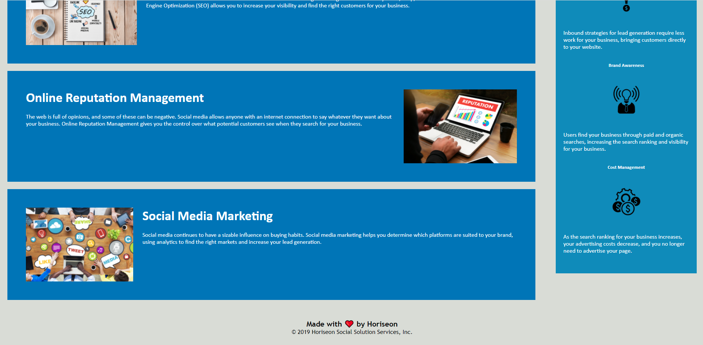

# SEO-Refactor-HTML-Horiseon
This is the first homework assignment for the OSU coding boot camp. We are refactoring functional code to use higher coding standards.

Previously the html on the page was using many div tags while there were more semantic tags that would be applicable; along with the images not having the alt attribute added on them for accessability for everyone. 

## In this refactor

    1.The div tags have been changed to the appropriate tags.
    2.The CSS has been updated to work alongside the new tags.
    3.Whitespace has been added for cleaner readability.
    4.CSS has been re-organized in order to follow the flow of the webpage.
    5.CSS comments have been added for each of the sections.
    6.Title has been changed from website to "Horiseon".

## Installation
Use Gitbash to clone the repository using SSH
[SSH](git@github.com:aclelandx/SEO-Refactor-HTML-Horiseon.git)

Or download the Repo and launch the index.html into your web browser

## Links

GitHub Repo : (https://github.com/aclelandx/SEO-Refactor-HTML-Horiseon)

GitHub Pages : (https://aclelandx.github.io/SEO-Refactor-HTML-Horiseon/)

## Screenshots

Screenshot previews of the website

## Contributing
Pull requests are welcome. For major changes, please open an issue first to discuss what you would like to change.

The Base code was provided by the instructors of the Ohio State Coding Boot Camp as part of the first homework assignment.

## License 
MIT License

Copyright (c) [2022] [Adam Cleland]

Permission is hereby granted, free of charge, to any person obtaining a copy
of this software and associated documentation files (the "Software"), to deal
in the Software without restriction, including without limitation the rights
to use, copy, modify, merge, publish, distribute, sublicense, and/or sell
copies of the Software, and to permit persons to whom the Software is
furnished to do so, subject to the following conditions:

The above copyright notice and this permission notice shall be included in all
copies or substantial portions of the Software.

THE SOFTWARE IS PROVIDED "AS IS", WITHOUT WARRANTY OF ANY KIND, EXPRESS OR
IMPLIED, INCLUDING BUT NOT LIMITED TO THE WARRANTIES OF MERCHANTABILITY,
FITNESS FOR A PARTICULAR PURPOSE AND NONINFRINGEMENT. IN NO EVENT SHALL THE
AUTHORS OR COPYRIGHT HOLDERS BE LIABLE FOR ANY CLAIM, DAMAGES OR OTHER
LIABILITY, WHETHER IN AN ACTION OF CONTRACT, TORT OR OTHERWISE, ARISING FROM,
OUT OF OR IN CONNECTION WITH THE SOFTWARE OR THE USE OR OTHER DEALINGS IN THE
SOFTWARE.